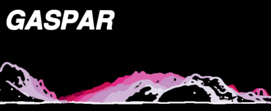

> This repo was archived because it only corresponded to the state of development before the SAGEO'19 conference (current development is done on a private repository hosted by our lab.). See the page https://steamer.imag.fr/?page_id=792 for more information about GASPAR interface or the page https://choucas.ign.fr/ for more information about the CHOUCAS project.


## *Geoviz Application for Searching People And Rescuing* - Prototype developed under [CHOUCAS Projet](http://choucas.ign.fr))

> **Geovisualization interface prototype** that exploits the **Choucas Ontology Alert** (Ontologie d'Alerte Choucas - http://purl.org/oac) and whose functionalities aim to support, facilitate and optimize the rescuer's reasoning.  

> Interface prototype and ontology are described in the paper :  
>  *__L’Ontologie d’Alerte Choucas : de la modélisation des connaissances à un outil support d’un raisonnement géovisuel - Application à la recherche de victime en haute-montagne__. Matthieu Viry & Marlène Villanova-Oliver. SAGEO'19. Clermont-Ferrand, France*.

## Usage
#### Option 1 - Using Docker

- Copy this repository:

```
git clone https://gricad-gitlab.univ-grenoble-alpes.fr/genoudph/choucas \
  && cd choucas \
  && git checkout version_matt_sageo19
```

- Build the docker container (it may take some time because it has to compile some dependencies from scratch but it's a one-time operation):

```
docker build -t "gaspar_choucas" .
```

- Run the container and expose the application on port 8008:

```
docker run docker run --publish "8008:8008" -it "gaspar_choucas:latest"
```
(please refer to [Docker documentation](https://docs.docker.com/) regarding to the other available options like starting the container as a deamon, etc.)

- The application is now accessible (after a few dozen of seconds!) in a web-browser on http://localhost:8008/.


#### Option 2 - Installing for development
**Required dependencies:**
Notably : `Python 3.6, GRASS 7.8, GDAL 2.x, PROJ 5.2, GEOS 3.7, git, nodejs & npm`  
(the provided Dockerfile can be a good start if you want to install them on ubuntu 18+)


- Copy this repository:

```
git clone https://gricad-gitlab.univ-grenoble-alpes.fr/genoudph/choucas \
  && cd choucas \
  && git checkout version_matt_sageo19
```

- Install Python dependencies and spaCy model for French:

```
pip3 install -r requirements.txt
python3 -m spacy download fr_core_news_sm
```

- Install Node dependencies:

```
npm install
```

- Starting the server application and watching for changes in JS code:

```
python3 server_app.py & npm run watch
```

This command will start the Python server application while watching for changes in Javascript code ;
the application is now accessible in a web-browser on http://localhost:8008/.

## Video demonstrations

- [Guided tour of the interface *(no sound)*](https://steamer.imag.fr/wp-content/uploads/2019/10/screencast_gaspar_tour_guide.mp4)  
- [Commented use-case *(comments in french)*](https://steamer.imag.fr/wp-content/uploads/2019/10/screencast_gaspar_usecase_audio.mp4)


## Other details

#### Technical overview

Server code uses `aiohttp` and relies heavily on `shapely` (GEOS python bindings), `rasterio` and `GRASS`.

Client code notably uses `webpack` (to bundle the code), `phosphor.js` (providing a flexible tab-based layout), `openlayers`, `itowns` and `sweetalert`.

#### Browser compatibility

Intended browser compatibility : last 2 (desktop) versions of Chrome and Firefox + last version of Opera and Safari.

#### Code style

Python source code follows PEP8 conventions (use `flake8` to ensure it) and Javascript code style follows AirBNB guidelines (with some minor amendments) and is enforced with `ESLint` (see `.eslintrc.js` file for details).


#### Repository structure

```
choucas                   <--- GASPAR interface "root" folder
│
├── data
│   ├── osm               <--- Data extracted from OSM (GeoJSON format)
│   └── elevation         <--- Elevation data (zip archive of geotiff files)
│
├── src                   <--- Source files for client code
│   ├── css
│   ├── img
│   ├── js
│   └── json              <--- JSONschemas derived from Choucas Ontology Alert
│
├── dist                  <--- Static assets after compilation
│
└── server_app.py         <--- Source file for server code
```

## License

The code is provided under BSD 3-clause licence.

Geospatial features in use are comming from OpenStreetMap (credits: OpenStreetMap Contributors), the licence is the [ODbL](https://opendatacommons.org/licenses/odbl/index.html).  
Elevation data (EU-DEM, version 1.1) is comming from the Copernicus programme of the European Environment Agency (EEA), the full licence is available on [EUR-Lex](https://eur-lex.europa.eu/legal-content/EN/TXT/?uri=CELEX%3A32013R1159).
